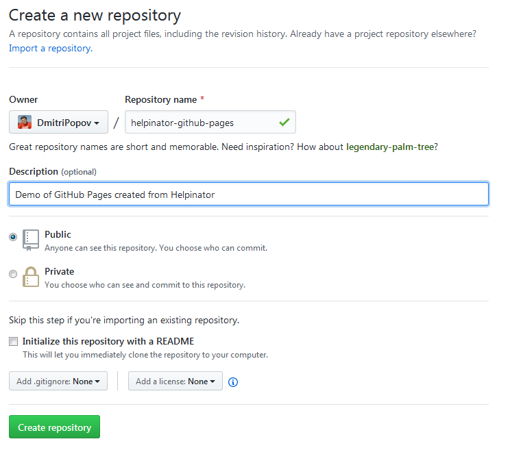

[Home](index "") &gt;  [Create a repository](createarepository "Create a repository")

# Create a repository

Start with creating a new repository that will act as a source of your GitHub pages. Skip this step if you want to publish documentation to existing repository.

Create a repository

[Clone repo to your PC --&gt;](clonerepotoyourpc "Next")

[&lt;-- Intro](intro "Previous")
