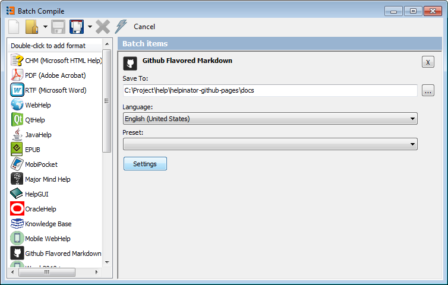
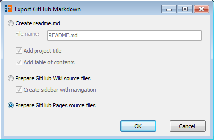

[Home](index "") &gt;  [Export GitHub pages from Helpinator](exportgithubpagesfromhelpinator "Export GitHub pages from Helpinator")

# Export GitHub pages from Helpinator

Now launch Helpinator and click lightning bolt icon on the main tool bar.

"Batch compile" dialog appears. 

Batch compile

Browse the list of the left to "Github Flavored Markdown" and double-click it to add a new batch item.

Set "Save to" path to the docs folder in our cloned repo folder. Click "Settings".

GitHub export settings

Select "Prepare GitHub Pages source files", click "OK".

Now click the lightning bolt icon and Helpinator will generate all required project files.

[Commit project files --&gt;](commitprojectfiles "Next")

[&lt;-- Clone repo to your PC](clonerepotoyourpc "Previous")
