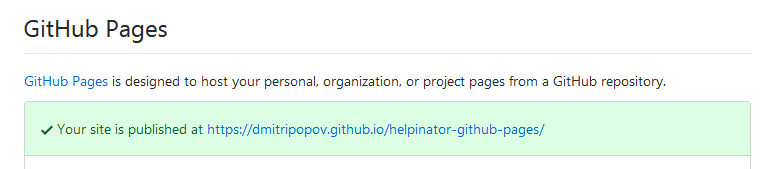

[Home](index "") &gt;  [See the result](seetheresult "See the result")

# See the result

When everything is ready, the top of "GitHub Pages" section will show a link to your GitHub Pages website:

The link to site

The result of this tutorial is available here:  [https://dmitripopov.github.io/helpinator-github-pages/](https://dmitripopov.github.io/helpinator-github-pages/ "https://dmitripopov.github.io/helpinator-github-pages/")

[&lt;-- Set up GitHub pages](setupgithubpages "Previous")
