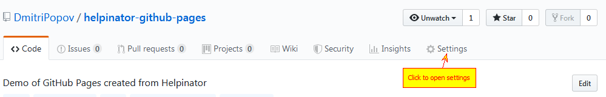
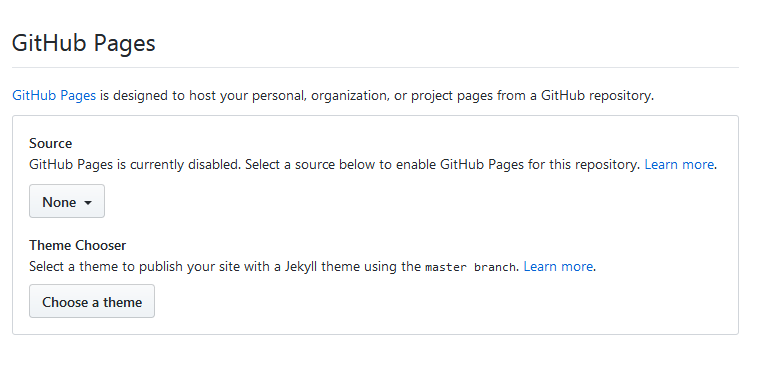

[Home](index "") &gt;  [Set up GitHub pages](setupgithubpages "Set up GitHub pages")

# Set up GitHub pages

Now we can open our repo on GitHub and proceed to repo settings:

Repository Settings

Scroll down to "GitHub Pages" section.

Untitled

Select "master branch / docs folder' as the source. And then pick a theme of your choice that will be applied to your pages.

[See the result --&gt;](seetheresult "Next")

[&lt;-- Commit project files](commitprojectfiles "Previous")
